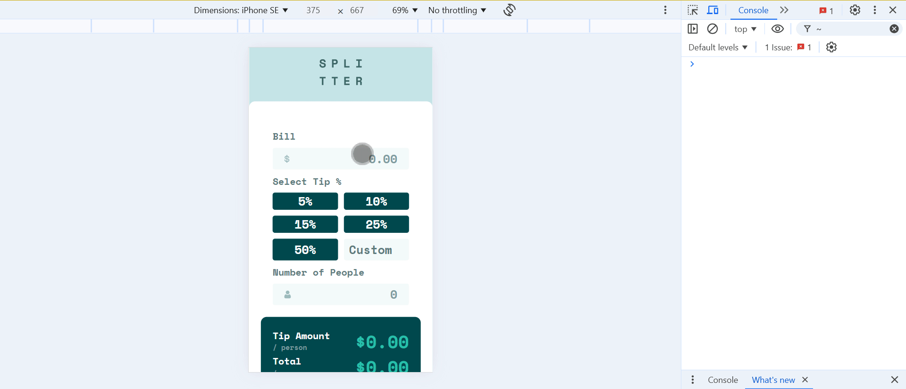

# Frontend Mentor - Tip calculator app solution

This is a solution to the [Tip calculator app challenge on Frontend Mentor](https://www.frontendmentor.io/challenges/tip-calculator-app-ugJNGbJUX). Frontend Mentor challenges help you improve your coding skills by building realistic projects.

## Table of contents

- [Overview](#overview)
  - [The challenge](#the-challenge)
  - [Screenshot](#screenshot)
  - [Links](#links)
- [My process](#my-process)
  - [Built with](#built-with)
  - [What I learned](#what-i-learned)
  - [Continued development](#continued-development)
  - [Useful resources](#useful-resources)
- [Author](#author)

## Overview

### The challenge

Users should be able to:

- View the optimal layout for the app depending on their device's screen size
- See hover states for all interactive elements on the page
- Calculate the correct tip and total cost of the bill per person

### Screenshot



### Links

- Solution URL: [Github link](https://github.com/snigdha-sukun/tip-calculator-app)
- Live Site URL: [Tip calculator](https://tip-calculator-app-teal-zeta.vercel.app/)

## My process

### Built with

- Semantic HTML5 markup
- CSS custom properties
- Flexbox
- CSS Grid
- Vanilla Javascript

### What I learned

I learned how to stop user from typing any negative number:

```html
<input type="number" onkeypress="return event.charCode != 45" />
```

I learned how to stop user from typing any decimal number:

```html
<input type="number" onkeypress="return event.charCode <= 57" />
```

I learned how to remove the default arrows in the `<input type="number">`:

```css
input::-webkit-outer-spin-button,
input::-webkit-inner-spin-button {
  -webkit-appearance: none;
  margin: 0;
}
```

I learned how to change the color of the placeholder in the input:

```css
::placeholder {
    color: var(--grayish-cyan);
}

.custom-option::placeholder {
    color: var(--dark-grayish-cyan);
    text-align: center;
}
```

I learned how to add style input on focus:

```css
input:focus {
    border: 0.1em solid var(--strong-cyan);
    outline: none;
}
```

I learned how to add starting image in `<input>`:

```css
.bill {
    background-image: url("./images/icon-dollar.svg");
    background-repeat: no-repeat;
    background-position: 1em;
}

.people {
    background-image: url("./images/icon-person.svg");
    background-repeat: no-repeat;
    background-position: 1em;
}
```

I learned how to use `querySelectorAll` in JS file:

```js
const tipButtons = document.querySelectorAll('.tip-btn');

const removeActive = () => tipButtons.forEach((btn) => btn.classList.remove('active'));

tipButtons.forEach((button) => {
    button.addEventListener('click', () => {
        const tipValue = parseFloat(button.dataset.value);
        setActiveTip(button, tipValue);
    });
});
```

### Continued development

I still need to practice the positioning an element & `@media`. I need to practice using JS for making the UI to react to different events. I also need to learn about responsive CSS, HTML5 rules & JS.

### Useful resources

- [Change Placeholder Color](https://www.w3schools.com/howto/howto_css_placeholder.asp) - This helped me in changing the placeholder in the input.
- [Hide Arrows From Input Number](https://www.w3schools.com/howto/howto_css_hide_arrow_number.asp) - This helped me in styling the input by hiding the arrows.
- [Avoid decimal & negative number](https://stackoverflow.com/questions/37043867/how-to-avoid-decimal-values-in-input-type-number) - This helped me fix the input values.

## Author

- Frontend Mentor - [@snigdha-sukun](https://www.frontendmentor.io/profile/snigdha-sukun)
